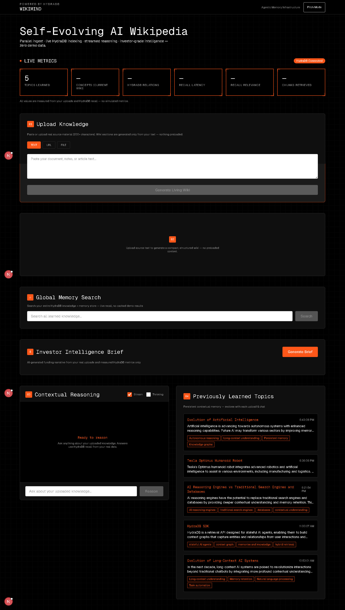

# WikiMind

**Self-Evolving AI Wikipedia powered by HydraDB**

WikiMind transforms uploaded knowledge into a living, structured Wikipedia article with persistent contextual memory, streamed reasoning, and investor-grade intelligence — built entirely on **real user data**, with no synthetic metrics or preloaded demo content.

[](https://github.com/anilkumara9/Hydra-DB)
[](https://nextjs.org)
[](https://www.typescriptlang.org/)

---

## Overview

Traditional AI assistants forget context after each session. WikiMind combines **OpenAI synthesis** with **HydraDB agentic memory** to:

1. **Ingest** text, URLs, or files in parallel with wiki generation  
2. **Structure** source-grounded articles with concise sections, verified facts, and reference data  
3. **Recall** knowledge via HydraDB for chat, search, and cross-topic fusion  
4. **Reason** with streamed answers and transparent recall traces  
5. **Brief** investors using only measured session metrics and uploaded content  

---

## Key Features

| Module | Capability |
|--------|------------|
| **Live Metrics** | Topics learned, concepts, HydraDB relations, recall latency, relevance, chunks retrieved — all from real operations |
| **Upload Knowledge** | Text, URL, or `.txt`/`.md` file ingest with parallel HydraDB indexing |
| **Living Wikipedia** | Compact tabbed article (Overview · Facts · Reference) with source fidelity badges |
| **Global Memory Search** | Full HydraDB recall across your knowledge base |
| **Investor Intelligence Brief** | AI funding narrative from your uploads and measured metrics only |
| **Contextual Reasoning** | Streamed chat with HydraDB recall trace and optional thinking mode |
| **Memory Timeline** | Persistent topic history across uploads |
| **Cross-Topic Fusion** | Emergent insights when multiple topics are learned |

---

## Architecture

```
Upload (text / URL / file)
        │
        ├─► HydraDB — knowledge upload + memory commit
        │
        └─► OpenAI — grounded wiki JSON → normalize & validate
                │
                ▼
        Living Wikipedia UI + session context
                │
        ├─► Chat / Stream API ──► HydraDB fullRecall ──► streamed answer
        ├─► Memory Search ──► global recall
        ├─► Index Monitor ──► verifyProcessing poll
        └─► Investor Brief ──► synthesis from wiki + metrics
```

---

## Tech Stack

- **Frontend:** Next.js 16 (App Router), React 19, TypeScript, Tailwind CSS v4  
- **AI:** OpenAI `gpt-4o-mini` (wiki, chat, briefs, cross-topic insights)  
- **Memory:** [HydraDB SDK](https://www.npmjs.com/package/@hydradb/sdk) — upload, recall, graph context, indexing  
- **Design:** HydraDB design system (black `#000000`, accent `#FF571A`, Geist Mono/Sans)  

---

## Quick Start

### Prerequisites

- Node.js 18+  
- [OpenAI API key](https://platform.openai.com/api-keys)  
- [HydraDB API key](https://hydradb.com)  

### Installation

```bash
git clone https://github.com/anilkumara9/Hydra-DB.git
cd Hydra-DB
npm install
```

### Environment

Copy the example file and add your keys to **`.env.local`** (Next.js does not load `.env.example` at runtime):

```bash
cp .env.example .env.local
```

```env
OPENAI_API_KEY=your_openai_key
HYDRA_DB_API_KEY=your_hydradb_key
HYDRA_TENANT_ID=wiki_mind_hackathon
HYDRA_SUB_TENANT_ID=wikimind_user
```

### Run

```bash
npm run dev
```

Open [http://localhost:3000](http://localhost:3000).

### Production build

```bash
npm run build
npm start
```

---

## Usage

1. **Upload** substantive source material (200+ characters recommended; 500+ for richest wikis).  
2. Wait for the **HydraDB Index Monitor** to report ready (~30–60 seconds).  
3. Explore the **Living Wikipedia** tabs and export Markdown if needed.  
4. Use **Contextual Reasoning** (stream on by default) to ask questions about your knowledge.  
5. Run **Global Memory Search** across all ingested content.  
6. Upload a second topic to unlock **cross-topic fusion**.  
7. Generate an **Investor Intelligence Brief** for pitch-ready narrative.  

> **Demo tip:** Use your own thesis, product docs, or research — never rely on pre-filled sample text. All metrics show `—` until real HydraDB recall occurs.

---

## API Routes

| Route | Method | Description |
|-------|--------|-------------|
| `/api/ingest` | POST | Parallel HydraDB upload + wiki generation |
| `/api/chat` | POST | Contextual Q&A with reasoning trace |
| `/api/chat/stream` | POST | SSE-streamed answers |
| `/api/memory-search` | POST | Global HydraDB recall search |
| `/api/index-status` | GET | Indexing status poll |
| `/api/warm-recall` | POST | Prefetch graph context after indexing |
| `/api/evolve` | POST | Cross-topic insights |
| `/api/investor-brief` | POST | Funding brief from session data |
| `/api/status` | GET | OpenAI + HydraDB configuration check |

---

## Data Integrity

WikiMind is designed for **honest, measurable demos**:

- HydraDB is **required** for ingest and chat — no fallback fake traces  
- Wiki content is **grounded** in uploaded source with normalization and length caps  
- Timelines and facts are omitted when not present in source (not invented)  
- Command center metrics reflect **live** recall and upload state only  
- Secrets belong in `.env.local` only — never committed  

---

## Project Structure

```
wiki-mind/
├── src/
│   ├── app/              # Pages & API routes
│   ├── components/       # UI modules (wiki, chat, graph, brief, …)
│   └── lib/              # OpenAI, HydraDB, wiki normalize/export
├── public/               # Static assets
├── presentation.md       # Hackathon slide content
└── .env.example          # Environment template
```

---

## Repository

**GitHub:** [github.com/anilkumara9/Hydra-DB](https://github.com/anilkumara9/Hydra-DB)

---

## License

See [LICENSE](LICENSE) in this repository.

---

## Screenshots

**WikiMind Command Center** — live metrics, knowledge ingest, memory search, contextual reasoning, and evolving topic timeline.


